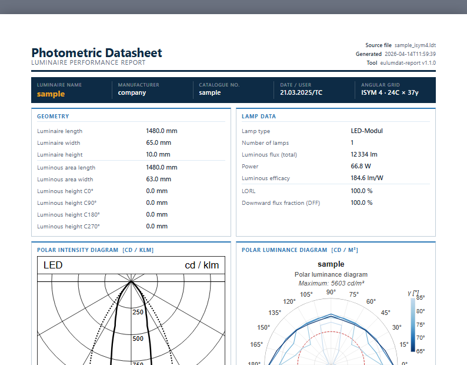

# eulumdat-quickstart

*A step-by-step guide to the `eulumdat-*` Python ecosystem*

The [EULUMDAT format](https://github.com/123VincentB/eulumdat-py/blob/main/docs/eulumdat_format.md)
(`.ldt`) is the standard file format for luminaire photometric data,
widely used in lighting design, photometric testing laboratories, and luminaire
manufacturing. Each file contains a text header (luminaire metadata, lamp data,
photometric factors) and an intensity matrix in cd/klm across C-planes and
γ-angles.

The `eulumdat-*` ecosystem is a set of 8 Python packages that let you read,
analyse, and visualise `.ldt` files — from simple header inspection to full
photometric datasheet generation. It was developed in an ISO 17025 accredited
photometry laboratory.

This guide walks through each package step by step, using two real sample
files. No prior photometry knowledge is required, but basic Python familiarity
is assumed.

---

> ⚠️ **Import names differ from package names.**
> The PyPI package name (used with `pip install`) is **not** the same as the
> Python import name. Always refer to the table below.

| PyPI package | Python import | Version |
|---|---|---|
| `eulumdat-py` | `from pyldt import ...` | 1.0.0 |
| `eulumdat-symmetry` | `from ldt_symmetry import ...` | 1.0.0 |
| `eulumdat-plot` | `from eulumdat_plot import ...` | 1.0.3 |
| `eulumdat-luminance` | `from eulumdat_luminance import ...` | 1.3.1 |
| `eulumdat-ugr` | `from eulumdat_ugr import ...` | 1.0.2 |
| `eulumdat-analysis` | `from ldt_analysis import ...` | 1.0.0 |
| `eulumdat-report` | `from eulumdat_report import ...` | 1.1.0 |
| `eulumdat-ies` | `from eulumdat_ies import ...` | 1.1.0 |

---

## Dependency chain

```
eulumdat-py  (pyldt)                           ← core, zero dependency
    ├── eulumdat-symmetry  (ldt_symmetry)       ← symmetrisation, ISYM detection
    ├── eulumdat-plot      (eulumdat_plot)       ← SVG polar intensity diagram
    ├── eulumdat-analysis  (ldt_analysis)        ← half-angles, FWHM
    ├── eulumdat-luminance (eulumdat_luminance)  ← luminance tables, polar diagram
    │       └── eulumdat-ugr (eulumdat_ugr)      ← UGR catalogue (CIE 117/190)
    ├── eulumdat-report    (eulumdat_report)     ← HTML/PDF datasheet (CLI + API)
    │       (depends on plot + luminance + ugr + analysis)
    └── eulumdat-ies       (eulumdat_ies)        ← bidirectional LDT ↔ IES LM-63-2002
```

---

## Sample files

Both files in `samples/` represent the **same luminaire**:

| File | ISYM | C-planes | γ-angles | Lines | Description |
|---|---|---|---|---|---|
| `sample_isym0.ldt` | 0 | 24 | 37 | 991 | Raw measurement — all C-planes stored |
| `sample_isym4.ldt` | 4 | 7 | 37 | 362 | Symmetrised — quarter symmetry |

Luminaire characteristics:
- Type: LED linear luminaire
- Housing: 1480 × 65 × 10 mm
- Luminous area: 1480 × 63 mm
- Lamp: LED module, 12 334 lm, 66.8 W
- LORL: 100 % / DFF: 100 %

---

## Sample report

The final output of this guide is a complete A4 photometric datasheet.
Click the image to open the interactive HTML report:

[](https://htmlpreview.github.io/?https://raw.githubusercontent.com/123VincentB/eulumdat-quickstart/main/examples/sample_isym4.html)

---

## Table of contents

| Step | Guide | Topic |
|---|---|---|
| 0 | [docs/00_setup.md](docs/00_setup.md) | Setting up your environment |
| 1 | [docs/01_parse.md](docs/01_parse.md) | Parsing an LDT file |
| 2 | [docs/02_symmetry.md](docs/02_symmetry.md) | Detecting and applying photometric symmetry |
| 3 | [docs/03_plot.md](docs/03_plot.md) | Polar intensity diagram |
| 4 | [docs/04_luminance.md](docs/04_luminance.md) | Luminance table and polar diagram |
| 5 | [docs/05_ugr.md](docs/05_ugr.md) | UGR catalogue |
| 6 | [docs/06_analysis.md](docs/06_analysis.md) | Beam half-angle (HAHM) |
| 7 | [docs/07_report.md](docs/07_report.md) | Full photometric report |
| — | [docs/08_ies.md](docs/08_ies.md) | Bonus — Working with IES files |
