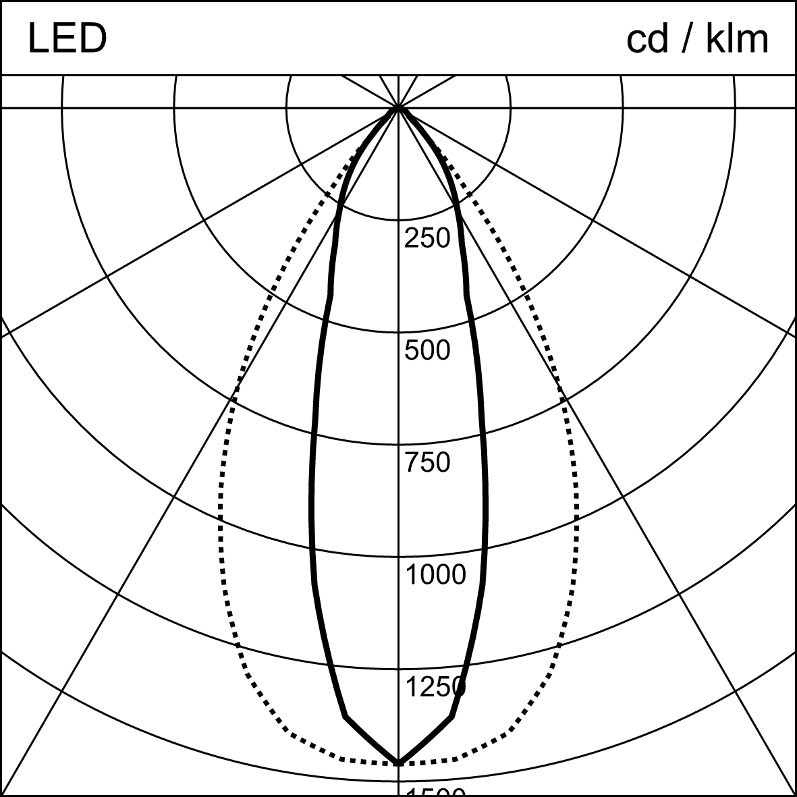

# Step 3 — Polar intensity diagram

`eulumdat-plot` generates polar intensity diagrams (cd/klm) in Lumtopic style:
a banner showing the luminaire type and unit, solid lines for C0/C180, and
dashed lines for C90/C270. Output formats are SVG (vector) and PNG (raster).

From this step onward we use `sample_isym4.ldt` — the symmetrised file is the
standard input for visualisation and analysis tools.

---

```python
from pathlib import Path
from eulumdat_plot import plot_ldt_svg
from eulumdat_plot.export import svg_to_png

Path("output").mkdir(exist_ok=True)

# SVG output (vector, opens in any browser)
svg_str = plot_ldt_svg("samples/sample_isym4.ldt")
svg_path = Path("output/plot.svg")
svg_path.write_text(svg_str, encoding="utf-8")
print("SVG written: output/plot.svg")

# PNG output (raster, for Word or presentations)
svg_to_png(svg_path, "output/plot.png")
print("PNG written: output/plot.png")

print("Open output/plot.svg in your browser to see the polar intensity diagram.")
```

Expected output:

```
SVG written: output/plot.svg
PNG written: output/plot.png
Open output/plot.svg in your browser to see the polar intensity diagram.
```

> Open `output/plot.svg` in your browser — this is your first visual result.
> The solid lines represent the C0/C180 planes (longitudinal), the dashed
> lines represent C90/C270 (transversal). For a linear luminaire like this
> sample, the two profiles are very different, which is expected.



---

Script: [`scripts/step_03_plot.py`](../scripts/step_03_plot.py)

> **See also:** `eulumdat-py` includes a lightweight matplotlib-based polar
> diagram example if you prefer a quick plot without additional dependencies —
> [02_polar_diagram.md](https://github.com/123VincentB/eulumdat-py/blob/main/examples/02_polar_diagram.md).

**Next step →** [Step 4 — Luminance table and polar diagram](04_luminance.md)
